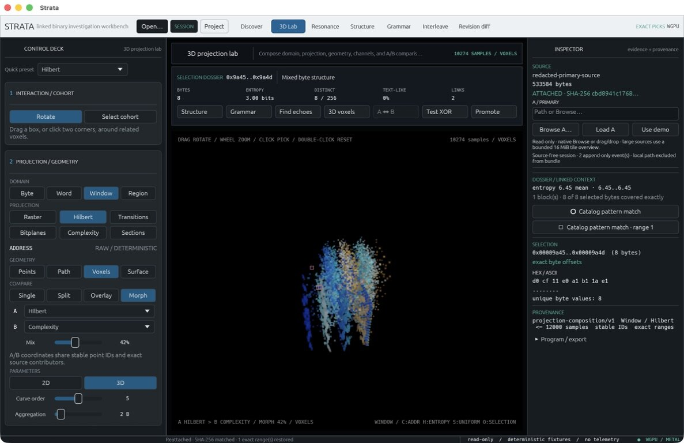

# Strata

[](https://github.com/a-Gb/strata/releases)

[](#license)

**Map raw binary data into linked visual evidence.**

Strata is a GPU-assisted investigation workbench for binary data. Select a
string, repeated block, signature, statistical boundary, pixel, or voxel and
trace it back to its exact source-byte range and analytical provenance.



## Download

**[Download Strata 0.1.0 for Apple Silicon](https://github.com/a-Gb/strata/releases/download/v0.1.0/Strata-0.1.0-arm64.dmg)**

Strata 0.1.0 is a public pre-alpha preview for Apple Silicon Macs running
macOS 15 or newer.

1. Open the DMG and drag **Strata** into **Applications**.
2. Launch Strata and choose **Open…**.
3. Select a local binary or start with the bundled demonstration.

Strata does not modify source files or upload them. Checksums and a CycloneDX
SBOM are available on the
[v0.1.0 release page](https://github.com/a-Gb/strata/releases/tag/v0.1.0).

## What can Strata reveal?

| Investigation | Useful evidence |
|---|---|
| Locate headers, records, embedded payloads, and structural boundaries | Address maps, entropy changes, regions, strings, and exact signatures |
| Find repeated or transformed data | Repetition, periodicity, correlation, and reversible XOR candidates |
| Explore flags, packed fields, interleaving, and byte relationships | Bit planes, transition fields, alignment, and linked 2D/3D projections |
| Compare binary revisions | Exact changed ranges, matched regions, displacement, and persistent selections |

No individual signal is treated as a verdict. High entropy, for example,
cannot by itself distinguish compression from encryption. Strata is most useful
when several independent views converge on the same byte ranges.

## A first investigation

1. Open a file and begin in **Discover** for a bounded whole-artifact survey.
2. Review candidate strings, repetition, periodicity, signatures, structural
   changes, and reversible transforms.
3. Select a finding to inspect its exact offsets, hexadecimal bytes, text
   rendering, contributors, confidence, and coverage.
4. Carry the same selection into **Structure**, **Grammar**, **Resonance**,
   **Interleave**, **Revision diff**, or **3D Lab**.
5. Save a local `.strata-project` or a portable, source-free
   `.strata-session` evidence bundle.

## Core capabilities

- **Exact, bidirectional picking:** visual elements and evidence rows map back
  to exact or explicitly sampled source ranges.
- **Linked analytical views:** selections persist across discovery, structure,
  relationship, comparison, and projection workspaces.
- **Bounded and deterministic analysis:** coverage, sampling, truncation, and
  unavailable analyzers remain visible instead of being implied away.
- **Candidate signature knowledge:** strict signature-pack matches preserve
  exact byte ranges, catalog attribution, and pack digests without asserting a
  file type.
- **Reproducible communication:** deterministic video programs, H.264 export,
  JSON provenance sidecars, and synthetic demonstration fixtures are included.
- **Metal acceleration where verified:** selected Alignment and Hamming
  projection coordinates use WGPU compute with CPU differential tests and an
  explicit fallback.

## Headless analysis

The CLI uses the same bounded runtime and provenance model as the desktop app.
From a source checkout:

```bash
cargo run -p strata-cli -- analyze fixtures/video/composite-firmware-v1.bin \
  --preset examples/presets/structure-entropy-fast.json \
  --range 0x0:0x200 \
  --output-format json
```

The JSON result excludes source paths and records the source digest, covered
ranges, preset, and canonical artifact digest.

## Build from source

Requirements: Apple Silicon, macOS 15+, stable Rust 1.85 or newer, Xcode
Command Line Tools, and [`just`](https://github.com/casey/just).

```bash
git clone https://github.com/a-Gb/strata.git
cd strata
just check
just test
cargo run -p strata-app-macos -- fixtures/video/composite-firmware-v1.bin
```

Build a local app bundle or DMG with:

```bash
just package-macos
just dmg
```

Local packages are ad-hoc signed by default. Maintainer signing and
notarization are documented in
[packaging/macos/README.md](packaging/macos/README.md).

## Current scope

Strata is an analytical pre-alpha, not a malware classifier, antivirus engine,
or supported forensic product.

- Discover currently surveys a declared 256 KiB exact prefix by default.
- One contiguous analysis request is capped at 64 MiB; larger sources use
  bounded reads, tiled overviews, explicit sampling, and exact focus ranges.
- Only selected analytical kernels currently execute through WGPU. Many
  analyzers and video rendering paths remain deterministic CPU work.
- Native sandboxing, complete keyboard/accessibility acceptance, installable
  third-party plugins, Intel support, and automatic updates are not complete.
- Signature and statistical labels are candidate evidence, never automatic
  safety, format, encryption, or compression verdicts.

Read the maintained
[implementation status](docs/20-implementation-status.md) before using Strata
with hostile, proprietary, or sensitive material.

## Privacy and evidence

- Local sources are opened read-only and are never uploaded by Strata.
- Strata has no telemetry or cloud-analysis dependency.
- Portable `.strata-session` bundles exclude source bytes and local paths.
- Private `.strata-project` files may contain local paths and are ignored by
  Git.
- Screenshots, videos, and exports can reveal source-derived structure; review
  them before sharing.

Strata analyzes attacker-controlled input and has not been independently
audited. See [SECURITY.md](SECURITY.md) for the current trust boundary and
responsible disclosure process.

## Contributing and extending

Contributions and experimental forks are welcome. New analyses should remain
deterministic, resource-bounded, and traceable to exact or explicitly sampled
source ranges. Third-party plugin installation is not enabled yet; the current
extension path is a source contribution or fork.

- [Contributing guide](CONTRIBUTING.md)
- [Documentation index](docs/INDEX.md)
- [Architecture](docs/01-architecture.md)
- [GUI reference](docs/21-gui-reference.md)
- [Roadmap](docs/11-roadmap.md)

## License

Strata source code and documentation are available under either the
[Apache License 2.0](LICENSE-APACHE) or [MIT License](LICENSE-MIT), at your
option. Synthetic fixtures are dedicated under
[CC0 1.0 Universal](fixtures/LICENSE-CC0).
