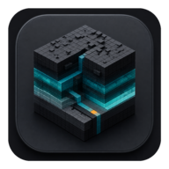
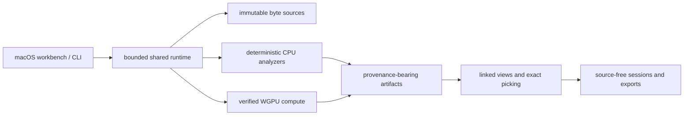

# Strata



[](https://github.com/a-Gb/strata/releases/tag/v0.1.0)
[](https://github.com/a-Gb/strata/releases)


[](#license)


**A GPU-assisted visual workbench for understanding binary data.**

Strata turns raw bytes into linked maps, transition fields, statistical spaces,
bit planes, section layouts, and 3D projections. Click a visual feature and
Strata takes you back to the exact source-byte range and the transform that
produced it.

It is designed for data discovery, format research, firmware exploration,
reverse engineering, comparison, and explainable visual communication—not for
automatically declaring a file safe, malicious, encrypted, or compressed.


## Download

**[Download Strata 0.1.0 for Apple Silicon](https://github.com/a-Gb/strata/releases/download/v0.1.0/Strata-0.1.0-arm64.dmg)**

Requirements:

- Apple Silicon Mac (`arm64`)
- macOS 15 or newer
- About 20 MB of free space

Open the DMG, drag **Strata** into **Applications**, then launch it normally.
The release is hardened, signed with a Developer ID certificate, notarized by
Apple, and carries a stapled notary ticket.

To verify the download manually:

```bash
curl -LO https://github.com/a-Gb/strata/releases/download/v0.1.0/Strata-0.1.0-arm64.dmg
curl -LO https://github.com/a-Gb/strata/releases/download/v0.1.0/Strata-0.1.0-arm64.dmg.sha256
shasum -a 256 -c Strata-0.1.0-arm64.dmg.sha256
```

The release also includes a checksum-verified CycloneDX SBOM bundle covering
all 18 workspace crates.

The 0.1.0 release is a pre-alpha preview. Use copies of important files and
read the [current limitations](docs/20-implementation-status.md) before using
it in a sensitive workflow.

## Your first investigation

1. Choose **Open…** and select a local file. Strata opens it read-only.
2. Start in **Discover** to find candidate strings, repetition, periodicity,
   signatures, structural changes, and reversible XOR relationships.
3. Move between **Structure**, **Grammar**, **Resonance**, **Interleave**,
   **Revision diff**, and **3D Lab**. Selections remain linked.
4. Click a point, voxel, range, or finding to inspect its exact offsets,
   hexadecimal bytes, text rendering, contributors, and provenance.
5. Save a private `.strata-project` to reopen local paths and UI state, or a
   source-free `.strata-session` when you need a portable evidence trail.

Large files are not copied wholesale into memory. Strata uses bounded reads,
tiled overviews, explicit sampling, and exact focus ranges. The contiguous
analysis path is currently capped at 64 MiB.

## What Strata helps reveal

| Question | Useful views and evidence |
|---|---|
| Where do regions, rows, headers, or embedded payloads begin? | Address raster, Hilbert plane/cube, entropy and region overlays |
| Is a region text-like, structured, repetitive, packed, or statistically unusual? | Complexity phase space, byte transitions, recurrence, strings, entropy |
| Does the data contain flags, masks, planar channels, or bit corruption? | Bit-plane stack and Hamming projection |
| What record width or interleave is plausible? | Alignment lattice, stride relationships, periodicity, spectral evidence |
| Which blocks repeat or correlate? | Exact repeats, recurrence, correlation, and repetition skyline evidence |
| Does a region resemble a known signature? | Strict signature-pack candidates with exact match ranges and pack provenance |
| What changed between two revisions? | Linked diff ranges, matched regions, and revision displacement evidence |
| How can I explain the finding to someone else? | Persistent selections, evidence notes, deterministic sessions, and programmable video exports |

No single view is treated as a verdict. High entropy, for example, cannot by
itself distinguish compression from encryption. Strata is strongest when
several independent views point to the same source range.

## Projection model

Strata separates concepts that many binary visualizers collapse together:

```text
Binary
  → sample domain      Byte | Word | Window | Region
  → projection         Raster | Hilbert | Transition | Phase | Parsed layout
  → geometry           Points | Path | Voxels | Surface
  → visual channels    Colour | Height | Size | Opacity | Motion
  → overlays           Regions | Strings | Signatures | Selection
```

The default projection families are **Raster**, **Hilbert**,
**Transitions**, **Bitplanes**, **Complexity**, and **Sections**. Advanced
work includes alignment, recurrence, spectrum, Hamming space, hierarchy, and
address paths. Named A/B projections can be viewed as split, overlay, or morph
while every datum retains stable source contributors.

The core invariant is:

> Rendered datum → source byte range → transform and sampling provenance.

## Privacy and evidence boundaries

- Files are opened read-only and never uploaded.
- There is no telemetry or cloud-analysis dependency.
- Portable sessions exclude source bytes and local source paths.
- Private project locators may contain local paths and are ignored by Git.
- Signature matches and statistical similarities are presented as candidate
  evidence, never authoritative file-type or security verdicts.
- Screenshots and exports can still reveal source-derived structure; review
  them before sharing.

Strata analyzes attacker-controlled input and is not yet sandboxed or
independently audited. See [SECURITY.md](SECURITY.md) before examining hostile
or sensitive material.

## Build from source

The supported development target is Apple Silicon with macOS 15 or newer.
Install Xcode Command Line Tools, stable Rust, and
[`just`](https://github.com/casey/just):

```bash
xcode-select --install
brew install rustup just
rustup-init
```

Clone, validate, and run:

```bash
git clone https://github.com/a-Gb/strata.git
cd strata
just check
just test
cargo run -p strata-app-macos
```

Open a specific file from the command line:

```bash
cargo run -p strata-app-macos -- /absolute/path/to/source.bin
```

Build an optimized local app or DMG:

```bash
just package-macos
just dmg
open target/artifacts/Strata-0.1.0-arm64.dmg
```

Local packages are ad-hoc signed by default. Maintainer-only Developer ID and
notarization steps are documented in
[packaging/macos/README.md](packaging/macos/README.md).

## Headless analysis

The CLI uses the same bounded runtime and provenance model as the desktop app:

```bash
cargo run -p strata-cli -- analyze Cargo.toml \
  --preset examples/presets/structure-entropy-fast.json \
  --range 0x0:0x200 \
  --output-format json
```

Machine-readable output excludes source paths and includes source digests,
covered ranges, presets, and canonical artifact digests.

## Extend Strata

Contributions and experimental forks are welcome. The most useful extension
points are:

- `crates/strata-analysis` — deterministic CPU analyzers and discovery
  findings.
- `crates/strata-views` — projection mappings with source-range round trips.
- `crates/strata-gpu` — bounded WGPU kernels with mandatory CPU differential
  tests and fallback.
- `crates/strata-runtime` — shared planning, budgets, and artifact orchestration.
- `schemas/` and `wit/` — versioned interchange and future plugin contracts.
- `fixtures/` — tiny deterministic, redistributable examples with digests and
  expected properties.
- `examples/video/` — programmable camera, projection, morph, and evidence
  narratives.

Third-party plugin installation is not enabled yet; the current extension path
is a source contribution or fork. New analyses must remain deterministic,
resource bounded, and traceable to exact or explicitly sampled source ranges.

Start with [CONTRIBUTING.md](CONTRIBUTING.md), the
[architecture](docs/01-architecture.md), and the
[implementation status](docs/20-implementation-status.md).

## Architecture at a glance



The [documentation index](docs/INDEX.md) covers the product model, algorithms,
GPU pipeline, interaction model, sessions, security, performance budgets,
plugin direction, and roadmap. The
[GUI reference](docs/21-gui-reference.md) separates the current executable
baseline from the target workbench hierarchy and its layout invariants.

## Project status

Strata 0.1.0 is the first public pre-alpha preview. The working path includes
the desktop workbench, CLI, linked 2D/3D projections, bounded large-file access,
selected Metal compute, deterministic sessions, signature knowledge, and video
programs. Native sandboxing, installable third-party plugins, broader GPU
coverage, update delivery, Intel support, and a stable compatibility promise
remain future work.

See the [changelog](CHANGELOG.md), [roadmap](docs/11-roadmap.md), and
[maintained implementation status](docs/20-implementation-status.md).

## Community

- Use [GitHub Discussions](https://github.com/a-Gb/strata/discussions) for ideas,
  projection design, and format-research questions.
- Use [GitHub Issues](https://github.com/a-Gb/strata/issues) for reproducible
  bugs and focused feature proposals.
- Use [private vulnerability reporting](https://github.com/a-Gb/strata/security/advisories/new)
  for security-sensitive reports. Never attach proprietary binaries, private
  paths, credentials, or live malware to a public issue.

## License

Strata source code and documentation are available under either the
[Apache License 2.0](LICENSE-APACHE) or [MIT license](LICENSE-MIT), at your
option. Synthetic fixtures are dedicated under
[CC0 1.0 Universal](fixtures/LICENSE-CC0).
