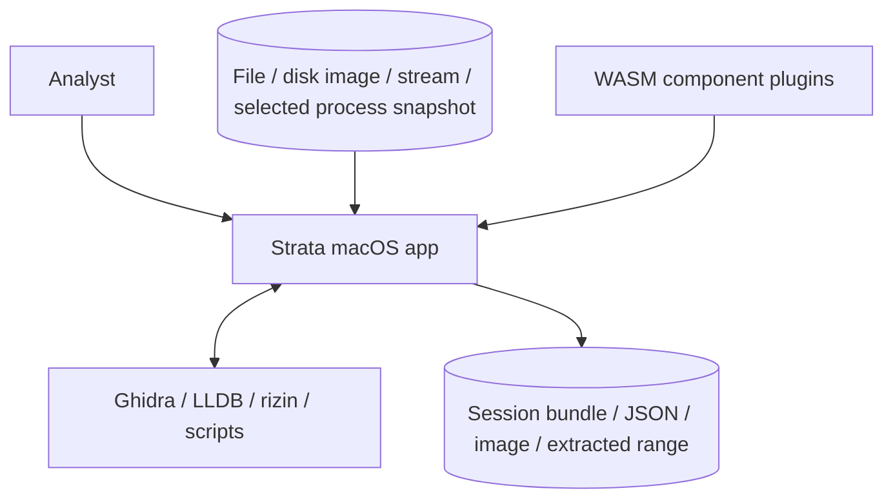
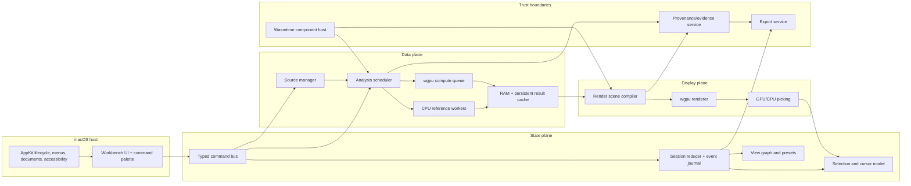
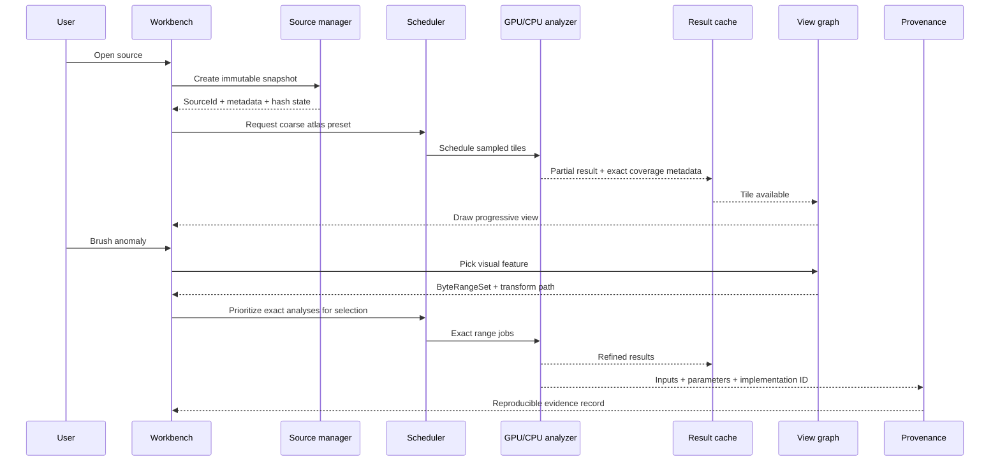

# Architecture

## Architectural style

Strata uses a layered, message-driven desktop architecture with immutable source snapshots, explicit analysis jobs, content-addressed results, and a retained view graph. The GUI is a client of the same core contracts used by the CLI.

## System context



## Runtime component model



## Layer responsibilities

| Layer | Owns | Must not own |
|---|---|---|
| macOS host | App lifecycle, windows, menus, file authorization, drag/drop, accessibility bridge | Analysis algorithms or session truth |
| UI | Commands, dock layout, inspectors, interaction feedback | Direct file reads or direct GPU resource mutation |
| Session | Serializable user intent and state transitions | Raw source bytes or transient GPU handles |
| Source | Snapshot identity, capabilities, bounded reads, sparse ranges, live generations | Visualization policy |
| Analysis | Job planning, cancellation, prioritization, CPU/GPU equivalence | Window widgets or source mutation |
| GPU | Device/queue, resource budgets, pipelines, shader registry | Domain decisions or plugin trust policy |
| Render | View primitives, batching, picking IDs, compositing | Long-lived source ownership |
| Provenance | Dependency graph from source to artifact | Interpretation beyond recorded facts |
| Plugin host | Capability mediation, quotas, component lifecycle | Unrestricted filesystem/network/native code |
| Export | Reproducible session/report/image/range outputs | Silent inclusion of source bytes |

## Key data flow



## State model

The session is updated through typed commands and reduced into serializable state. Transient render objects and OS handles remain outside the session.

```text
Command -> validation -> reducer -> SessionEvent -> SessionState
                                      |             |
                                      |             +-> view invalidation
                                      +-> append-only journal / undo
```

Commands carry a `generation` and optional `caused_by` identifier. Long-running results are accepted only when their generation still matches the current source, transform, and view request. This prevents stale background work from overwriting newer intent.

## Concurrency model

| Execution context | Responsibilities | Rules |
|---|---|---|
| Main/AppKit thread | Window lifecycle, native input, accessibility, display/HDR queries | Never block on I/O or analysis |
| Render coordinator | Frame graph assembly, queue submission, resource retirement | Receives immutable render snapshots |
| Async I/O runtime | File/stream reads, hashing, external bridge IPC | Bounded concurrency and cancellation |
| CPU analysis pool | Reference analyzers, parsers, reductions unsuitable for GPU | Pure or isolated jobs; no UI access |
| GPU queue | Compute and render passes | Budgeted allocations; explicit generations |
| Session writer | Journal, cache metadata, evidence records | Single-writer ordering |
| Plugin workers | WASM components | Fuel/time/memory/capability limits |

Cross-context communication uses bounded channels. Backpressure is visible: low-priority jobs are coalesced or dropped before interactive work.

## Source lifecycle

1. The host obtains authorized access to a file or connector.
2. The source manager creates a `SourceSnapshot` with stable identity and metadata.
3. Hashing is progressive. A session may begin with a provisional identity, then seal once the digest completes.
4. Reads are range-based and read-only.
5. Live inputs create monotonically increasing generations; prior generations remain addressable if retained.
6. Closing a source invalidates capabilities and cancels dependent jobs, but leaves source-free session state intact.

## Analysis lifecycle

1. A view emits an `AnalysisDemand` describing domain, resolution, priority, precision, and visibility.
2. The planner deduplicates demands and resolves cache hits.
3. The scheduler selects CPU or GPU implementation based on capabilities, exactness, payload size, and current pressure.
4. Results arrive as partial, refined, complete, cancelled, or failed envelopes.
5. The view graph consumes immutable result handles and recompiles only affected scene nodes.
6. Provenance records the source coverage, transform graph, analyzer identity, parameters, approximation, and result digest.

## Rendering model

Views do not issue arbitrary GPU commands. They emit declarative scene fragments:

- tiled scalar or categorical fields;
- point/line/triangle clouds;
- instanced glyphs;
- volume slices;
- text and annotations;
- selection overlays;
- semantic regions;
- pickable IDs linked to source coverage.

The render compiler batches compatible fragments, allocates transient resources, and builds a frame graph. This keeps the renderer auditable and allows external plugins to contribute visuals without raw GPU access.

## Failure containment

- Source read error: mark only affected ranges unavailable.
- Analyzer panic/crash: convert to failed result; disable the analyzer instance.
- GPU device loss: recreate device and fall back to CPU/basic renderer when possible.
- Out-of-memory: evict caches, lower resolution, disable expensive 3D passes, then report a bounded error.
- Plugin timeout or quota breach: terminate component and preserve host/session state.
- Corrupt session: recover valid journal prefix and quarantine invalid records.
- Export failure: write to a temporary target and atomically replace only on success.

## Architectural seams

The following are explicit replacement points:

- AppKit host versus a future cross-platform host.
- `wgpu` backend versus an isolated Metal-specific fast path.
- In-process CPU analyzer versus helper-process isolation.
- Wasmtime component host versus a future standardized plugin runtime.
- SQLite-backed metadata versus another transactional store.
- Built-in view set versus third-party declarative views.

## Dependency direction

```text
app-macos / cli
       -> ui / session / export / observability
       -> views / render
       -> analysis / gpu / plugin-host
       -> source / provenance
       -> core

No lower layer imports an application or UI layer.
```
