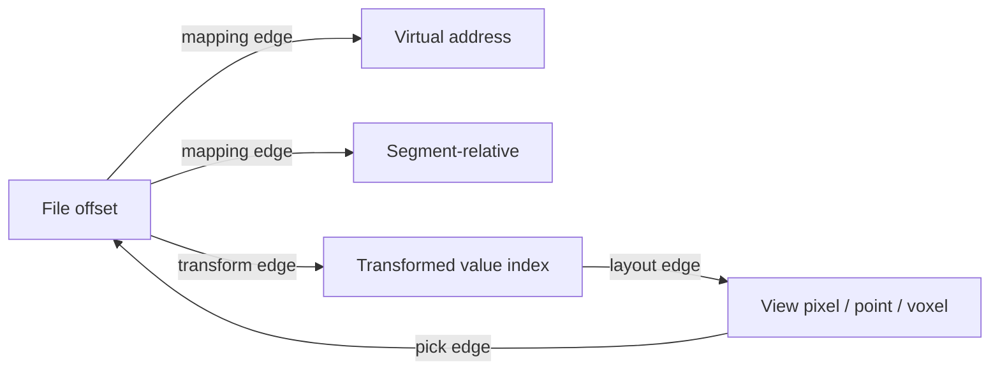

# Domain model

## Core invariants

1. A `ByteRange` is half-open: `[start, end)`.
2. Range arithmetic is checked; overflow is an error, never wraparound.
3. Every source read identifies a source snapshot and generation.
4. Every analysis result declares exact source coverage and whether it is sampled, approximate, or exact.
5. Every pickable visual primitive resolves to one or more source ranges or explicitly declares that it is aggregate-only.
6. Session state contains no opaque GPU handles or non-serializable OS objects.
7. Transforms form a directed acyclic graph. Cycles are rejected.
8. A transform cannot claim reversibility without an inverse specification and loss model.
9. Cached results are keyed by all inputs that can affect output.
10. ML-derived scores are annotations on deterministic evidence, not replacements for it.

## Primary types

| Type | Purpose |
|---|---|
| `SourceId` | Stable identity for an opened source snapshot |
| `SourceGeneration` | Monotonic version for live/mutable connectors |
| `ByteRange` | Exact half-open source interval |
| `ByteRangeSet` | Normalized, non-overlapping collection of ranges |
| `AddressSpace` | File offsets, virtual addresses, physical addresses, stream sequence, or named segment space |
| `ReadRequest` | Bounded ranges plus priority and consistency requirements |
| `ByteChunk` | Returned bytes, actual range, source identity, completeness, digest state |
| `TransformGraph` | Reproducible chain from source bytes to derived byte/value domain |
| `SamplingPolicy` | Exact, systematic, stratified, reservoir, mip-level, or adaptive sampling declaration |
| `AnalysisSpec` | Analyzer identity, parameters, domain, requested precision, implementation policy |
| `AnalysisResult` | Typed payload plus coverage, completeness, errors, metrics, and provenance token |
| `ViewSpec` | View kind, bindings, camera, palette, filters, interaction policy |
| `SelectionSet` | Named selections with ranges, colors/roles, labels, and origin |
| `EvidenceRecord` | Human claim linked to source, selections, view state, and provenance |
| `ArtifactId` | Content identity of a cached or exported artifact |

## Coordinate systems

A source may expose more than one coordinate system. A firmware image can have file offsets, flash addresses, virtual addresses, and parser-defined section-relative positions.



Mappings are first-class records with:

- source and destination spaces;
- valid domains;
- exact, one-to-many, many-to-one, or approximate cardinality;
- transformation parameters;
- invertibility;
- implementation identity.

## Source model

### Capabilities

```text
KnownLength
RandomRead
SequentialRead
SparseRanges
StableSnapshot
LiveUpdates
AddressMappings
MetadataOnly
Privileged
Remote
```

A view or analyzer declares required capabilities. The planner rejects impossible work early rather than failing during execution.

### Source kinds

| Kind | Initial scope | Notes |
|---|---:|---|
| Local file | MVP | Read-only, memory-mapped/windowed implementation |
| Directory/package | Phase 2 | Presents concatenated and per-entry spaces |
| Sparse disk/firmware image | Phase 2 | Holes represented explicitly, never materialized as bytes silently |
| Standard input / pipe | Phase 2 | Append-only generations with retention policy |
| TCP/UDP capture stream | Later | Network capability opt-in; packet/stream coordinate spaces |
| Process snapshot | Later | Direct distribution only; explicit privilege and freeze semantics |
| Remote object | Later | Opt-in connector with range requests and local caching |

## Selection model

Selections are independent of any view. A selection can originate from brushing, exact offset entry, parser objects, search results, another tool, or an analysis rule.

```text
Selection {
  id
  label
  role: primary | comparison | exclusion | evidence | transient
  ranges: ByteRangeSet
  address_space
  source_id + generation
  transform_path
  origin
  created_at
}
```

A single visual cell can map to many ranges, especially under sampling or aggregate views. The inspector must distinguish:

- exact contiguous range;
- exact discontiguous set;
- sampled contributing set;
- aggregate domain with no enumerable full set;
- approximate inferred range.

## Transform graph

Transforms are typed and reproducible. Examples:

- slice or concatenate ranges;
- stride and deinterleave;
- endian reinterpretation;
- word-width reinterpretation;
- bit extraction or bit-plane projection;
- XOR with constant or selected key bytes;
- rotate/shift/mask;
- decompression probe;
- text decoding;
- parser field projection;
- rolling-window statistic.

Each node declares:

```text
TransformNode {
  kind
  input_domain
  output_domain
  parameters
  determinism
  reversibility
  loss_model
  resource_estimate
  implementation_id
}
```

Transforms that execute arbitrary code or decompress attacker-controlled data must run under stricter quotas or isolation.

## Analysis request and result envelope

```text
AnalysisRequest {
  source
  ranges
  transform_graph
  analyzer
  parameters
  requested_resolution
  requested_precision
  sampling_policy
  priority
  deadline_hint
  generation
}

AnalysisResult<T> {
  artifact_id
  payload: T
  covered_ranges
  source_generation
  completeness: partial | refined | complete
  exactness: exact | bounded_approximation | sampled | heuristic
  sampling_policy
  warnings
  performance_metrics
  provenance_token
}
```

Results must be immutable. Refinement produces a new result that supersedes, rather than mutates, the previous artifact.

## View specification

A view is declarative state plus bindings to analysis outputs.

```text
ViewSpec {
  id
  kind
  source_binding
  transform_binding
  analysis_bindings[]
  layout
  camera
  palette
  filters
  selection_policy
  linked_group
  rendering_quality
}
```

View kinds are versioned. Unknown fields are retained during round-trip serialization where feasible so sessions survive plugin absence or older clients.

## Provenance model

Provenance is a DAG:


The minimal reproducibility tuple is:

```text
(source digest, source length, address mappings, ranges, transform graph,
 analyzer ID/version, parameters, sampling policy, precision, view ID/version,
 palette/camera/filter state, application schema version)
```

## Cache identity

A cache key includes:

```text
hash(
  source_content_id,
  source_generation,
  normalized_ranges,
  transform_graph_digest,
  analyzer_id,
  analyzer_version,
  parameter_digest,
  sampling_policy,
  precision,
  implementation_semantics_version,
  device-independent compatibility flags
)
```

GPU vendor or driver identity is recorded for diagnostics, but should not fragment cache keys when the result is defined as device-independent and verified against the reference implementation.
