# GPU compute and rendering pipeline

## Decision

Use `wgpu` as the default compute/render abstraction and select its Metal backend on macOS. Keep domain semantics independent of GPU APIs. A Metal-specific fast path is a later, isolated optimization, not part of the initial architecture.

## Why this shape

- The workloads are dominated by parallel classification, histogramming, reduction, tiling, point generation, and rasterization.
- Apple Silicon shares system memory between CPU and GPU, but allocations and synchronization still require explicit budgeting.
- A portable GPU abstraction gives a testable reference path and avoids making every analyzer depend on Objective-C/Metal details.
- Native AppKit integration remains available for lifecycle, display, input, accessibility, and future HDR control.

## Pipeline overview

```mermaid
flowchart LR
    A[Range read / mmap window] --> B[Upload or shared staging]
    B --> C[Decode / classify]
    C --> D[Compute pass family]
    D --> E[Reduction / compaction]
    E --> F[Multi-resolution artifact]
    F --> G[Texture / storage buffer cache]
    G --> H[Scene compilation]
    H --> I[Render passes]
    I --> J[Display + picking]
```



## Resource domains

| Domain | Typical representation | Lifetime |
|---|---|---|
| Source staging | byte-aligned buffers or packed `u32` words | Per job/window |
| Histograms | integer storage buffers | Per artifact/refinement |
| Scalar fields | R16/R32 integer/float textures | Cached by tile/mip |
| Categorical maps | compact integer textures + palette lookup | Cached by tile/mip |
| Sparse 3D points | structure-of-arrays storage buffers | View-visible working set |
| Geometry | instanced vertices or generated indirect draws | Frame/transient |
| Picking | integer ID target + mapping table | Frame/transient |
| Readback | small bounded buffers | On demand only |

## Multi-resolution strategy

Large sources are represented as a tile pyramid rather than one monolithic image.

```text
L0: exact or near-exact leaf tiles
L1: aggregation of L0
L2: aggregation of L1
...
Ln: source overview
```

A tile key contains source, generation, transform, analyzer, tile coordinate, level, precision, and sampling policy. Coarse levels are prioritized for visible coverage; fine levels are requested by zoom, selection, or export.

### Tile rules

- Tiles have fixed logical dimensions but variable source coverage.
- Edge tiles record actual coverage.
- Aggregation functions are analyzer-specific: mean is not a valid universal reducer.
- Categorical maps preserve counts or dominant-class confidence rather than only final color.
- Exact exports can force refinement and reject sampled tiles.

### Executable POC slice

The POC now implements the first bounded slice rather than only carrying contracts:

- 256 KiB resident payloads, at most 64 tiles and 16 MiB per large-source plan;
- deterministic systematic overview coverage plus background level-zero focus refinement;
- tile identity over source, generation, semantics, level, coordinate, precision, and parameter digest;
- a WGSL compute kernel for Alignment Lattice and fixed-basis Hamming Hypercube coordinates;
- startup and CLI CPU/GPU differential checks, including offsets above 4 GiB and a 1 TiB logical domain;
- visible CPU fallback; recurrence search, local DFT, and hierarchy remain bounded CPU references.

This is not yet the persistent multi-analyzer tile cache or indirect renderer described by the full architecture.

## Compute pass families

### Byte atlas

Inputs: source bytes, layout parameters, palette/classification parameters.

Outputs: categorical/scalar tile and offset mapping metadata.

Layouts:

- linear raster;
- zigzag raster;
- Hilbert curve;
- Morton/Z-order;
- block/section-aware packing;
- user-defined declarative layouts.

Offset-to-pixel and pixel-to-range mapping must share the same tested integer implementation or generated lookup table.

### Entropy and local statistics

Statistics include:

- Shannon entropy;
- byte-class density;
- zero/`0xff` density;
- printable/UTF likelihood;
- chi-square against uniform;
- local mean and variance;
- compressibility proxy;
- unique-symbol count;
- rolling hash novelty.

The initial GPU design uses block-local histograms and hierarchical reduction. Sliding windows that cross block boundaries use overlap halos or a second merge pass. The exact CPU path defines edge behavior and normalization.

### Digram

A 65,536-bin integer histogram maps `(b[i], b[i+stride])` to `x + 256*y`.

Pass outline:

1. Each workgroup processes a bounded byte span.
2. Workgroup-local bins are used when supported and profitable; otherwise use partitioned global histograms.
3. Partial histograms are reduced.
4. Optional region moments capture approximate source position without retaining every occurrence.
5. A normalization pass produces count, log-count, probability, or conditional-probability textures.

The result retains counts, not only luminance, so palettes and normalization can change without re-reading the source.

### Layered digram

A naïve `regions × 65,536` dense cube becomes expensive. The planner chooses among:

- dense texture array for small region counts;
- sparse active-bin lists per region;
- compressed tiles;
- top-K bins with residual mass;
- progressive region subdivision;
- selected-range-only exact computation.

The view can render slices, stacked planes, a ray-marched density volume, or an animated longitudinal sweep.

### Trigram

The theoretical 16,777,216-bin domain is handled as sparse data.

Candidate algorithms:

- GPU hash table with bounded probing;
- radix sort of packed 24-bit keys followed by run reduction;
- count-min sketch for overview plus exact selected-region refinement;
- top-K heavy hitters per source region.

No algorithm is committed until the spike compares throughput, memory pressure, determinism, and device portability.

### Bit-plane and word lens

Bytes or words are unpacked into bit planes, endian interpretations, signed/unsigned scalar fields, and width sweeps. These passes are bandwidth-bound and good early GPU candidates.

### Periodicity and recurrence

- autocorrelation for selected ranges;
- byte/word recurrence plots;
- rolling-hash self-similarity matrices;
- frequency-domain magnitude for numeric reinterpretations;
- candidate record-width scoring.

Large quadratic matrices require sampling, tiling, or selected-range limits. The UI must expose those limits.

### Diff and similarity

For aligned sources:

- exact XOR/delta map;
- equality runs;
- rolling-hash anchor candidates;
- per-tile entropy/statistic deltas;
- n-gram divergence;
- insertion/deletion alignment supplied by CPU algorithms.

The GPU accelerates comparison and visualization; it does not silently invent alignment.

## Rendering

### 2D

- texture-tiled atlas with level-of-detail selection;
- GPU palette lookup and normalization;
- semantic overlays as instanced rectangles/paths;
- selection masks and outlines;
- text labels culled by screen-space density;
- lens overlays that render a higher-resolution or alternate projection locally.

### 3D

- instanced trigram points;
- layered digram planes;
- sparse volume slices;
- transition graph nodes/edges;
- optional depth cueing and clipping planes.

Every 3D primitive carries a picking ID that resolves to aggregate statistics and contributing ranges. Decorative depth must not hide uncertainty or sampling.

### Picking

Two paths are supported:

1. Analytical picking for deterministic layouts such as raster, Hilbert, and matrix coordinates.
2. Integer render-target picking for arbitrary geometry and dense overlays.

Readback is limited to a small pixel neighborhood and debounced. Hover can use approximate CPU spatial indexes while click selection confirms through the exact path.

## Frame scheduling

Interactive frames prioritize:

1. input and camera updates;
2. visible cached tiles;
3. selection overlays;
4. coarse missing tiles;
5. exact visible refinements;
6. prefetch;
7. offscreen analysis and export.

A frame should never wait for an analyzer. Missing data renders as an explicit loading/approximation state.

## Memory policy

The GPU service enforces:

- a global budget derived from configured policy, not reported free memory alone;
- per-view and per-plugin quotas;
- LRU/priority eviction for recreatable artifacts;
- pinning only for currently visible or export-critical resources;
- bounded staging and readback pools;
- adaptive quality reduction before allocation failure;
- recorded allocation failures and device-loss diagnostics.

The default should be conservative on 8–16 GB systems and scale upward. No view may assume the entire source or all n-gram states fit in GPU memory.

## CPU reference path

Core analyzers have scalar or parallel CPU implementations used for:

- correctness tests;
- unsupported adapters;
- small inputs where GPU dispatch overhead dominates;
- exact fallback after device loss;
- reproducible headless CLI output;
- differential fuzzing against GPU kernels.

Integer counts should match exactly. Floating-point normalized outputs use documented tolerances and preserve raw integer statistics when possible.

## Metal-specific fast-path gate

A native path is admitted only when all conditions hold:

1. A real corpus demonstrates a material bottleneck.
2. `wgpu` cannot expose the required capability or performance.
3. The operation has a reference implementation and golden tests.
4. Unsafe/FFI code is isolated in a dedicated crate.
5. Failure falls back to the `wgpu` path.
6. The session records which semantics version produced the artifact.

Potential candidates include advanced counters, specialized memory behavior, indirect command optimizations, or platform-specific capture—not core correctness.

## Shader governance

- First-party shaders are versioned with analyzer semantics.
- WGSL is validated before pipeline creation.
- External plugins cannot supply backend passthrough shaders.
- Plugin shader packages declare bindings, workgroup sizes, resource ceilings, and deterministic expectations.
- Runtime compilation errors disable only the affected view/pass.
- Shader source or digest is included in diagnostics and provenance where it affects semantics.
