# Interaction model

## Core workflow

```mermaid
flowchart LR
    Open[Open source] --> Overview[Progressive overview]
    Overview --> Notice[Notice feature]
    Notice --> Select[Brush or query range]
    Select --> Correlate[Linked views refine]
    Correlate --> Hypothesis[Apply reversible transform / semantic overlay]
    Hypothesis --> Verify[Inspect exact bytes and alternate projections]
    Verify --> Evidence[Record claim with provenance]
    Evidence --> Escalate[Export / bridge / compare]
```



## Workbench regions

### Source rail

- open sources and source generations;
- nested package/segment/address-space navigator;
- hashing state and source capability badges;
- semantic overlays and plugin enablement;
- comparison group assignment.

### Canvas

- dockable 2D/3D visualization panes;
- synchronized cursor and selection overlays;
- per-pane toolbar limited to view-specific controls;
- compact legends that expose normalization, sampling, and precision;
- progressive-resolution indicator without modal blocking.

### Inspector

- exact offset/address in all known spaces;
- byte/word/string interpretations;
- selected range statistics;
- contributing ranges for aggregate cells;
- transform path;
- analyzer/view provenance;
- warnings and approximation bounds.

### Evidence notebook

- named selections;
- hypotheses and confidence notes;
- screenshots linked to live view state;
- analyzer findings promoted or rejected by the analyst;
- exportable reproducibility record.

### Timeline/tracks

- offset-aligned scalar tracks;
- parser regions and annotations;
- live-source generations;
- analysis completion and boundary candidates.

## Linked interaction

Views join one or more link groups:

| Link | Effect |
|---|---|
| Cursor | Hovering one view shows corresponding location/domain in peers |
| Selection | Brushing creates a shared `SelectionSet` |
| Domain | Pan/zoom in offset-oriented views follows the same range |
| Normalization | Comparable views share count/scale parameters |
| Camera | Optional for small multiples of the same 3D domain |
| Comparison | Actions apply to paired or corpus sources |

Linking is explicit and visible. A user can break a link to explore independently without changing other views.

## Selection semantics

### Gestures

- click: exact cell/primitive selection;
- drag: rectangular or lasso brush;
- shift: add ranges;
- option: subtract ranges;
- command: promote transient selection to named evidence;
- double-click: zoom to contributing ranges;
- keyboard: enter offsets/ranges directly;
- context command: “open selection in…” another view, bridge, extractor, or transform branch.

### Aggregate selection

When a cell represents many bytes, the UI presents:

```text
Cell represents 4,096 bytes
Coverage: exact contiguous [0x120000, 0x121000)
Statistic: Shannon entropy, 256-byte windows, mean of 16 windows
Result: exact
```

For a digram cell:

```text
Pair: 0x20 -> 0x65
Occurrences: 18,421
Contributing ranges: aggregate, index available
Position distribution: 63% in selected section
Action: materialize occurrence index / sample 100 / select all
```

The application does not imply that a matrix cell has one offset.

## Hypothesis branches

Applying a transform or parser creates a branch rather than modifying the base view.

```text
source
  ├─ raw atlas
  ├─ UTF-16 interpretation
  ├─ stride 4 / lane 2
  └─ XOR 0xA5
       ├─ entropy
       └─ strings
```

Branches can be pinned, compared, renamed, or discarded. The inspector shows branch ancestry and loss/reversibility.

## Command model

All meaningful actions are commands available through menus, shortcuts, context actions, and the command palette. Examples:

```text
Open Source…
Go to Offset…
Create View: Digram
Link Selection to Group A
Refine Visible Range Exactly
Create Transform Branch: Stride/Deinterleave…
Promote Selection to Evidence…
Send Range to Ghidra
Export Reproducible View…
Copy Provenance JSON
```

Commands declare whether they are undoable, source-affecting, privileged, long-running, or export-producing.

## Keyboard and trackpad

- Space-drag or two-finger pan: canvas navigation.
- Pinch: zoom.
- `[` / `]`: previous/next selection or finding.
- `G`: go to range.
- `V`: view palette.
- `T`: transform palette.
- `P`: command palette.
- `E`: promote selection to evidence.
- `R`: request exact refinement for visible domain.
- `1`–`9`: activate saved workspace presets.

Actual bindings are user-configurable and exported separately from analytical session state.

## Progressive feedback

Each view shows a compact state:

```text
coarse sampled -> refining -> exact visible -> exact full
```

The legend includes:

- coverage percentage;
- sampling method;
- current resolution;
- analyzer version;
- warnings;
- whether export at current state is analytical or illustrative.

## Accessibility

- All palettes have perceptual and color-vision-safe presets.
- Information is never encoded by color alone.
- Canvas primitives expose accessible summaries and selected-object descriptions through the AppKit accessibility bridge.
- 3D views have keyboard navigation, tabular fallback, and projection summaries.
- Text scaling does not change analytical coordinate mapping.
- Animation respects reduced-motion settings.

## Presentation and report mode

A report frame stores:

- source hash reference;
- view specification;
- camera/domain;
- selected evidence;
- legend/normalization;
- analysis completeness;
- caption and analyst notes.

Frames can be replayed against a matching source. Static export remains linked to the frame’s provenance record.
