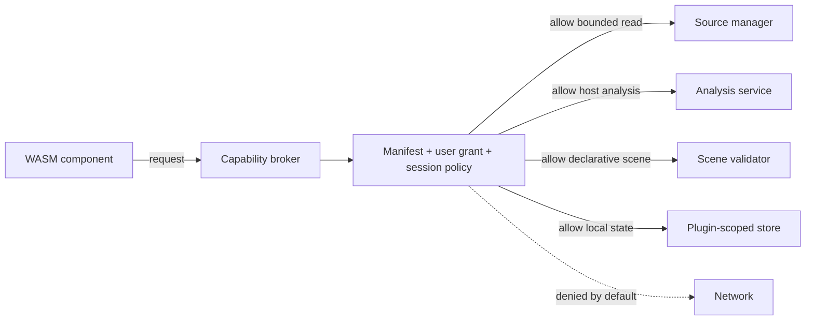

# Plugin system

## Goals

- Extend analyzers, semantic overlays, views, exporters, and commands.
- Preserve host stability when a plugin fails or is malicious.
- Keep source access explicit and range-bounded.
- Avoid a permanent native ABI commitment for third-party code.
- Allow first-party GPU-intensive features without forcing untrusted code into the render process.

## Plugin tiers

### Tier 0 — first-party native crates

Used for core analyzers and views shipped with the application.

Capabilities:

- internal typed APIs;
- approved GPU compute/render primitives;
- direct content-addressed cache integration;
- full test and release pipeline.

Trust:

- part of the signed application;
- reviewed like core code;
- no stable external ABI promise.

### Tier 1 — WASM component plugins (default external model)

Implemented through the WebAssembly Component Model and WIT-defined interfaces.

Capabilities are granted per plugin and per session:

- read metadata;
- read approved source ranges;
- request host-provided statistics;
- emit typed findings;
- emit declarative scene primitives;
- register commands/presets/exporters;
- write plugin-local state;
- optional network access to declared domains, disabled by default.

Limits:

- memory ceiling;
- execution fuel/time budget;
- maximum result size;
- maximum source range per request;
- bounded concurrent calls;
- no raw OS handles;
- no arbitrary native shader or dynamic library loading.

### Tier 2 — trusted native extension (deferred)

A signed, manually enabled native extension may be considered for integrations impossible under WASM. It runs out of process and communicates through a versioned protocol.

It is not part of the initial release because it expands attack surface and compatibility obligations.

## Plugin types

| Type | Input | Output |
|---|---|---|
| Analyzer | Ranges, transform-domain values, parameters | Findings, scalar/vector/matrix artifacts, occurrence indexes |
| Overlay | Source metadata and analysis artifacts | Named regions, fields, labels, relations |
| Declarative view | Typed artifacts and view state | Safe scene primitives and picking mappings |
| Transform | Selected ranges and parameters | Derived byte/value stream with provenance mapping |
| Exporter | Session/evidence/view artifacts | Bounded output files |
| Connector | External source | `ByteSource`-like ranged access; privileged and separately approved |
| Command provider | Context snapshot | Typed command invocation/result |

## Capability model



Capabilities are handles, not ambient permissions. A plugin cannot infer a filesystem path or open arbitrary files from a source handle.

## Manifest

A plugin manifest declares:

```text
id, name, version, publisher, component digest,
minimum host API, plugin types, requested capabilities,
parameter schemas, result schemas, commands, views,
resource ceilings, deterministic claim, license, signature metadata
```

The user sees requested capabilities before enabling the plugin. Updates that expand capabilities require renewed approval.

## WIT interface principles

- Use canonical primitive and record types.
- Pass handles and bounded chunks rather than entire large sources.
- Make pagination and streaming explicit.
- Include cancellation and generation IDs.
- Version semantics at the world/interface level.
- Keep render output declarative.
- Return structured errors with retryability and user-safe messages.

The initial WIT shell lives in `wit/strata-plugin.wit`.

## Declarative scene API

External views can emit a restricted set:

- scalar tile references;
- categorical tile references;
- points, lines, rectangles, and bounded meshes;
- labels and legends;
- selection overlays;
- camera suggestions;
- picking metadata linked to source ranges or aggregate domains.

The host validates counts, sizes, coordinates, resource usage, and picking mappings. The plugin cannot submit command buffers.

## Optional plugin shaders

Not in MVP. A later shader package may contain validated WGSL with a fixed binding model and strict resource ceiling. It cannot use backend passthrough APIs. Shader output must be treated as an artifact and must expose provenance semantics.

## Plugin lifecycle

```text
Discover -> verify signature/digest -> inspect manifest -> grant capabilities
-> instantiate -> initialize -> invoke bounded jobs -> checkpoint local state
-> suspend/terminate -> update/revoke
```

A plugin instance is scoped to an application session unless it declares safe stateless reuse.

## Determinism

Plugins declare one of:

- deterministic;
- deterministic within numeric tolerance;
- deterministic given seed;
- heuristic/non-deterministic.

The declaration is included in provenance. Seeded plugins receive the seed from the host and cannot silently replace it.

## Distribution

Recommended initial distribution:

- local plugin directory;
- signed `.strata-plugin` bundle;
- explicit manual installation;
- no automatic remote catalog.

A catalog can be added later with transparency logs, signature verification, revocation, and reproducible publisher metadata.
