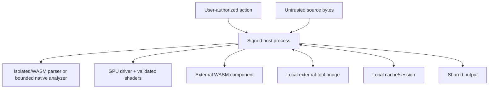

# Security and privacy architecture

## Assets

- original binary sources;
- selected sensitive ranges;
- filesystem paths and source metadata;
- analyst annotations and hypotheses;
- parser/plugin results;
- session and cache contents;
- local bridge access to external tools;
- application signing and plugin trust state.

## Threat actors and failures

- malicious or malformed source crafted to exploit parsers, decompressors, or GPU paths;
- malicious external plugin requesting or exfiltrating source data;
- accidental inclusion of source bytes in a shared session/report;
- resource-exhaustion input causing CPU, memory, disk, or GPU denial of service;
- stale or incorrect result shown against a newer source generation;
- compromised dependency or plugin update;
- bridge endpoint accessed by another local process;
- visualization designed to fool classifier or analyst expectations;
- corrupted session/cache causing misleading state.

## Trust boundaries



## Controls by threat

| Threat | Primary controls | Residual risk |
|---|---|---|
| Parser exploit | Prefer WASM/helper isolation; fuzzing; bounded inputs; minimal parser set | First-party native bugs remain possible |
| Decompression bomb | Output ratio, byte, time, nesting, and recursion ceilings | Legitimate extreme inputs may be truncated |
| Plugin exfiltration | No network by default; capability handles; range limits; explicit grants | User may grant a dangerous capability |
| GPU denial/crash | Validated WGSL; quotas; bounded buffers; device-loss recovery | Driver defects cannot be eliminated |
| Source mutation | Read-only handles; immutable snapshot metadata; digest checks | External file replacement before hash sealing |
| Stale result | Source generation and request generation on every artifact | Connector may misrepresent snapshot stability |
| Cache leakage | Local-only; configurable encryption/retention; no raw bytes by default | Derived statistics can still reveal content |
| Bridge abuse | Disabled by default; local authenticated endpoint; per-client approval | Compromised same-user process may attack client |
| Supply-chain compromise | Lockfile, cargo-deny/vet, SBOM, signed releases/plugins, update verification | Upstream compromise before detection |
| Misleading visualization | Provenance, alternate views, explicit sampling, adversarial tests | Human interpretation remains fallible |

## Source handling

- Open with read-only access.
- Do not follow symlink changes after authorization without revalidation.
- Record file identity metadata and progressive digest.
- Treat mutable files as unstable; warn and create a new generation on detected change.
- Avoid copying full content into application containers.
- Clear staging buffers when practical; never promise cryptographic erasure of unified-memory pages.
- Privileged sources use separate explicit connectors and are never auto-restored.

## App distribution

The recommended first distribution is a hardened, notarized direct build. This leaves room for disk images, external tool bridges, and later privileged connectors. The core should still avoid unnecessary entitlements and preserve a sandbox-compatible mode for less-privileged deployments.

## Plugin policy

- Verify bundle digest and optional publisher signature.
- Show requested capabilities and changes on update.
- Scope source handles to specific opened sources and ranges.
- Deny ambient filesystem, environment, process, and network access.
- Enforce memory, fuel, wall-time, output, and concurrency quotas.
- Validate all returned scene/data structures.
- Keep plugin-local storage namespaced and size-limited.
- Provide one-click revocation and cache/state deletion.

## GPU/shader policy

- Use validated WGSL through the normal abstraction path.
- No external backend-passthrough shaders.
- Bound every buffer and texture dimension before allocation.
- Check integer arithmetic used for byte counts, bins, dispatch sizes, and offsets.
- Reject workgroup or resource declarations above policy.
- Use canary fixtures and differential tests to detect semantic changes after driver/runtime updates.

## Local bridge

- Disabled unless enabled for a session or globally.
- Bind to a local-only transport.
- Authenticate clients using a per-session token or OS-mediated identity.
- Require explicit source association.
- Default messages contain metadata/ranges, not bytes.
- Log connection, requested actions, and transferred byte counts locally.
- Rate-limit and close idle clients.

## Privacy

- No telemetry by default.
- Diagnostics are local and inspectable before sharing.
- Crash reports require opt-in and redact paths/source-derived content.
- Session sharing includes an inventory/redaction step.
- ML models, if later added, run locally by default and do not train on user data.
- Plugins cannot access other sessions or the global cache unless a capability explicitly allows it.

## Supply chain and release

Required release gates:

```text
locked dependencies
cargo-deny / advisory review
cargo-vet or equivalent review records
reproducible build notes
CycloneDX SBOM
license inventory
binary signing + hardened runtime
notarization + stapling
plugin bundle signature verification
update signature verification
release provenance/attestation
```

## Security tests

- fuzz source readers, range arithmetic, schemas, transforms, parsers, and bridge messages;
- property-test offset/pixel round trips;
- run plugins with malformed/oversized outputs;
- inject cancellation and generation changes at every pipeline stage;
- simulate device loss and allocation failure;
- test path redaction and bundle inventory;
- adversarially perturb binaries to evaluate visual/classifier fragility;
- verify that opening and analyzing never changes source content or metadata intentionally.
