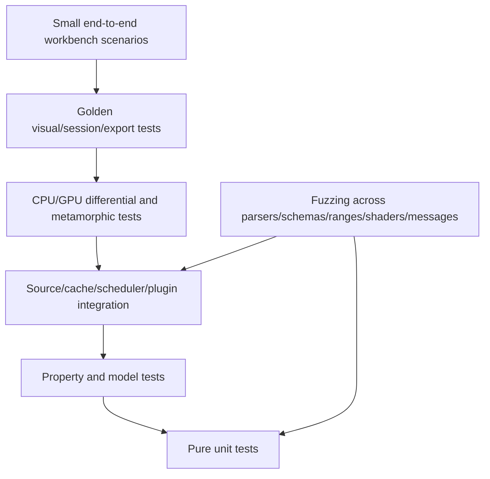

# Observability, verification, and test architecture

## Observability principles

- Local and inspectable by default.
- Diagnostic data must not contain source bytes, decoded strings, paths, or annotations unless explicitly enabled.
- Every long-running request has an ID, source generation, priority, and cancellation state.
- User-visible progress derives from the same state as diagnostic metrics.
- Performance counters are useful only when tied to view/analyzer semantics and input scale.

## Structured tracing

Recommended span hierarchy:

```text
session.open
  source.authorize
  source.snapshot
  source.hash
view.create
analysis.request
  analysis.plan
  source.read
  cpu.execute | gpu.upload -> gpu.compute -> gpu.reduce -> gpu.readback
  cache.write
view.compile_scene
frame.render
  frame.upload
  frame.compute
  frame.draw
  frame.pick
export.run
plugin.invoke
bridge.request
```

Common fields:

```text
request_id, command_id, source_id, generation, range_bytes,
analyzer_id, analyzer_version, view_id, tile_level, tile_coord,
exactness, sampling, cache_status, backend, device_class,
queue_wait_ms, execute_ms, bytes_read, bytes_uploaded, bytes_output,
allocation_bytes, cancellation_reason, error_code
```

## Metrics

### Interaction

- `frame_time_ms` p50/p95/p99;
- `input_to_present_ms`;
- `hover_pick_ms` and `click_pick_ms`;
- dropped/coalesced interaction jobs;
- visible tile completeness;
- selection-to-exact-inspector latency.

### Source and cache

- bytes read by source and priority;
- read amplification ratio;
- mmap/window churn;
- memory and persistent cache hit ratio;
- cache bytes by artifact family;
- eviction reason;
- provisional-to-sealed hash duration/state.

### Analysis

- scheduler queue depth by priority;
- queue wait and execution duration;
- CPU/GPU implementation choice;
- throughput in source bytes/s;
- partial/refinement count;
- cancellation and stale-result rejection count;
- CPU/GPU differential mismatch count.

### GPU/render

- live buffer/texture bytes by class;
- staging and readback pool pressure;
- compute and render pass timing when available;
- pipeline compilation/cache misses;
- device loss and allocation failure;
- level-of-detail fallback count;
- primitives, tiles, and labels per frame.

### Plugins

- instantiation failures;
- fuel/time/memory consumption;
- bytes exposed to each plugin;
- capability denials;
- invalid output and termination counts.

## Diagnostic UI

A developer overlay exposes:

- frame graph and pass timings;
- active jobs and cancellation;
- source read map;
- cache occupancy;
- GPU allocations;
- current precision/sampling per view;
- stale result rejections;
- plugin resource usage;
- provenance graph for the hovered primitive.

A user-facing status strip shows only actionable state: source instability, approximation, analysis failure, memory pressure, plugin disablement, or export incompleteness.

## Test pyramid



## Core property tests

### Ranges and coordinates

- `range.end - range.start == range.len` when valid;
- normalization is sorted, merged, and idempotent;
- no valid operation wraps `u64`;
- layout mapping never emits coordinates outside its declared extent;
- exact layouts satisfy `pixel_to_ranges(offset_to_pixel(i))` contains `i`;
- sampled layouts label missing/non-enumerable contributors accurately;
- address-space round trips hold wherever mapping is bijective.

### Provenance

- any exported visual artifact has a source/provenance root;
- changing an analyzer parameter changes its artifact/cache identity;
- changing only a palette does not invalidate raw counts;
- stale generations cannot attach results to current view state;
- source-free session serialization contains no source byte payloads;
- evidence supersession preserves prior records.

### Scheduling

- interactive demand preempts or coalesces lower-priority work;
- cancellation eventually stops dependent work and prevents publication;
- cache hits avoid source reads and analyzer execution;
- memory pressure invokes deterministic degradation order;
- repeated identical requests deduplicate.

## CPU/GPU differential testing

For every core kernel:

1. Generate deterministic input and parameter cases.
2. Run scalar CPU reference.
3. Run parallel CPU implementation if present.
4. Run GPU implementation.
5. Compare raw integer artifacts exactly.
6. Compare floating outputs using declared tolerance and NaN policy.
7. Persist minimal failing inputs.
8. Repeat across supported Apple Silicon generations and OS/driver updates.

Initial kernels:

- byte classification;
- raster/Hilbert/Morton mapping;
- block histograms;
- entropy/statistic reductions;
- digram and stride-N digram counts;
- bit-plane extraction;
- exact delta maps;
- tile pyramid aggregation;
- picking mappings.

## Metamorphic tests

Visual analysis is vulnerable to transformations that preserve or perturb semantics. Tests should assert understood behavior rather than universal invariance.

| Mutation | Expected checks |
|---|---|
| Add zero/`0xff` padding | Original ranges remain identifiable; global layout changes are disclosed |
| Reorder independent sections | Local fingerprints persist; positional features move |
| Recompile same source | Exact bytes differ; some statistical signatures may remain similar but not guaranteed |
| Compress/encrypt region | Entropy rises; semantic overlays disappear; tool does not claim which mechanism |
| XOR with constant | Histogram/transition changes documented; inverse transform restores exact artifacts |
| Change row width | Raw image structure should peak around plausible widths |
| Interleave channels | Stride/deinterleave branch should recover component structure |
| Insert malformed signature | Magic hit remains a candidate, not a final classification |
| Adversarial visual padding | Classifier confidence should degrade or explain conflicting evidence |

## Corpus design

### Synthetic canonical fixtures

- empty and one-byte sources;
- every byte value repeated;
- `0x00`, `0xff`, alternating patterns;
- byte ramp and wrapped counters;
- periodic records at prime and power-of-two widths;
- deterministic pseudo-random bytes;
- known entropy mixtures with exact boundaries;
- ASCII/UTF-8/UTF-16 text blocks;
- planar and interleaved bit fields;
- nested and overlapping signatures;
- sparse mappings and holes;
- very large virtual sources backed by generators.

### Real representative fixtures

Keep licenses and redistribution rights explicit. Recommended classes:

- Mach-O executable and universal binary;
- ELF and PE samples for cross-format contrast;
- PNG/JPEG/TIFF/RAW-like image assets;
- WAV/PCM and compressed audio;
- ZIP/gzip/zstd archives;
- SQLite and structured binary databases;
- firmware image with padding/tables/compressed payload;
- disk image/filesystem metadata;
- packet capture;
- memory dump subset;
- packed/obfuscated sample that is safe to store and analyze.

### Malformed/adversarial fixtures

- truncated headers and tables;
- overlapping/overflowing offsets;
- deep nesting;
- huge declared decompression output;
- crafted n-gram hot bins;
- extreme sparse range maps;
- plugin results with invalid coordinates or oversized arrays;
- corrupted session bundles and journals.

## Visual golden tests

Golden tests store semantic intermediate artifacts wherever possible, not only screenshots.

A golden case includes:

```text
fixture digest
preset
raw analyzer artifact digest
scene primitive digest
reference screenshot
allowed raster tolerance
platform/backend metadata
```

Screenshot differences are triaged as semantic, rendering, typography, driver, or expected visual change. Analytical regressions cannot be approved merely by replacing images.

## End-to-end acceptance tests

- open source, see coarse atlas, refine selected tile, inspect exact bytes;
- select a digram cell, materialize occurrences, navigate to one occurrence;
- create stride transform branch and compare to source;
- save/close/reopen source-free session and reattach matching source;
- reject a source with mismatched digest;
- run CLI preset and compare artifact digest to GUI result;
- terminate a plugin on quota breach without losing the session;
- simulate GPU loss and preserve evidence/state;
- export a redacted bundle and verify no path/source bytes remain.

### P1/tiled POC gates

- plan a 1 TiB logical source without exceeding 64 tiles / 16 MiB resident;
- open a sparse source above the contiguous threshold and retain logical coverage without whole-file allocation;
- click a sampled projection datum and publish an exact level-zero focus tile from the same file identity;
- rank a known fixed-record width, retain an exact recurrence partner, identify a periodic DFT bin, and split a strong hierarchy boundary;
- round-trip every P1 projection through composition JSON and attach identical analytical coordinates to video samples;
- dispatch Alignment and Hamming on the real WGPU adapter and compare every component against the CPU reference within `1e-5`.
