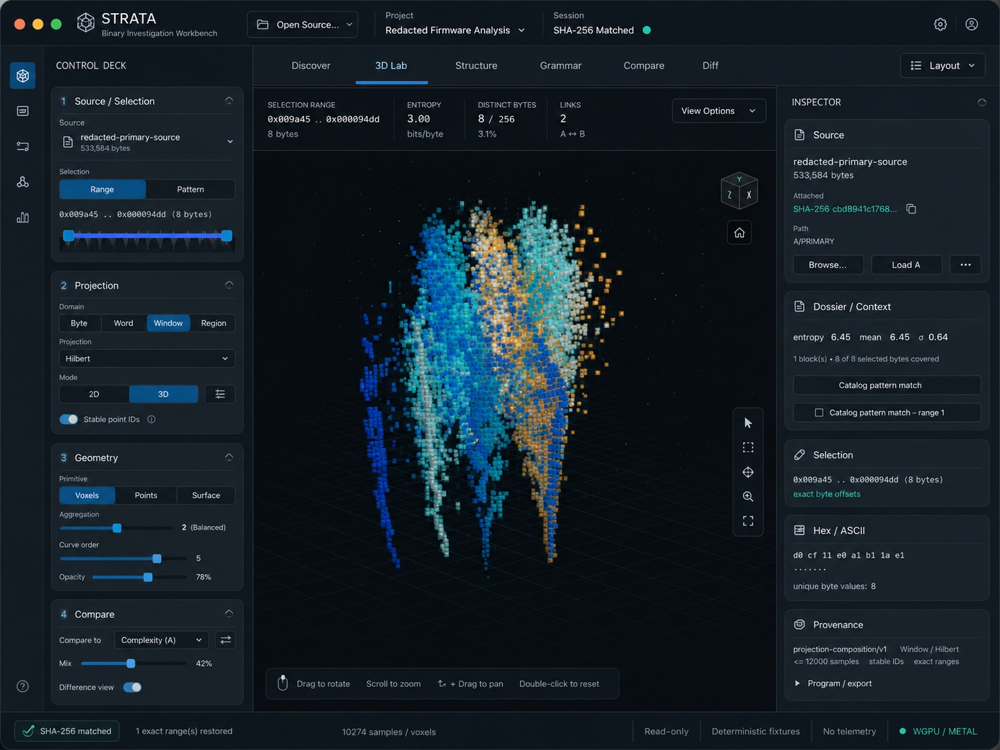
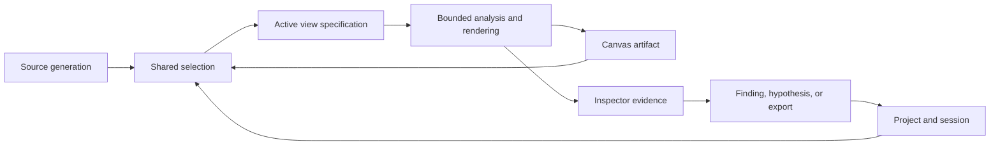

# GUI reference

> **Status:** design target for work after the `0.1.0` preview. The first image
> is a reference composition, not evidence of the current executable. Current
> behavior remains defined by tests and
> [`20-implementation-status.md`](20-implementation-status.md).



The reference expresses the intended product hierarchy: an investigation
workbench whose state, controls, visual evidence, and exact-byte provenance can
all be understood at a glance. It is not a request to reproduce every pixel.
The implementation should preserve native macOS behavior, accessibility, and
the analytical contracts beneath the interface.

## Product goal

The GUI should help an analyst move through this loop without losing context:

```text
open source -> notice structure -> select evidence -> compare explanations
            -> inspect exact bytes -> preserve or export the finding
```

At every point the user should be able to answer five questions:

1. Which source, project, session, and source generation am I viewing?
2. What exact or sampled byte range produced this visual feature?
3. Which projection, geometry, channels, and comparison state are active?
4. What can I do next without changing unrelated analytical state?
5. Is the result raw, parsed, heuristic, sampled, stale, or exact?

## What the reference gets right

- **Investigation state is global and persistent.** Source, project, session,
  digest status, read-only state, and compute backend do not disappear when the
  active view changes.
- **Tasks are the primary navigation.** Discover, 3D Lab, Structure, Grammar,
  Compare, and Diff describe analyst intent rather than implementation modules.
- **Controls read in analytical order.** Selection, projection, geometry, and
  comparison are distinct steps instead of one undifferentiated control list.
- **The canvas owns attention.** View-specific metrics and tools frame the
  visualization without covering it or competing with it.
- **The inspector explains, rather than merely reports.** Source attachment,
  linked context, exact selection, byte interpretation, and provenance are
  separate, scan-friendly records.
- **Trust signals remain visible.** Exact-range restoration, source digest,
  deterministic-fixture state, telemetry policy, and GPU backend are presented
  as status—not hidden in settings.

## Current executable baseline


The `0.1.0` baseline already implements the important semantic path: local
read-only source handling, linked selections, projection and geometry choices,
A/B comparison, exact picks, candidate signature evidence, provenance, and a
WGPU/Metal status path. The reference primarily improves information
architecture, visual hierarchy, control locality, and resilience at different
window sizes.

| Concern | `0.1.0` baseline | Reference direction |
|---|---|---|
| Application state | Source/session/project actions share a compact native header | Source, project, session, digest state, and account/settings have stable named regions |
| Navigation | Functional top tabs with mixed investigation and projection language | Task-oriented tabs with Compare and Diff promoted to peer workflows |
| Control deck | Dense projection controls expose much of the model at once | Numbered, collapsible steps with context-sensitive parameters |
| Workspace context | Dossier and actions consume a large block above the canvas | Compact metric strip; deeper actions move beside the evidence they affect |
| 3D canvas | Exact voxels and picking work, but the object can feel small and spatial tools are implicit | Canvas dominates; orientation, fit, selection, and zoom tools are explicit and local |
| Inspector | Correct source, context, selection, and provenance in a mostly flat rail | Stable cards with clear state, actions, disclosure, and copy affordances |
| Status | Important guarantees are present but visually compressed | Digest, restored ranges, sample count, read-only state, fixtures, telemetry, and backend are independently legible |
| Layout behavior | Narrow widths and control labels can crowd or clip | Fixed geometry, panel minima, explicit overflow, collapse, and drawer behavior |

## Interface ownership

Each region owns one kind of decision. This prevents duplicated controls and
state that appears to disagree.

| Region | Owns | Must not own |
|---|---|---|
| Global top bar | Open source, project, session, digest/attachment state, global settings | Per-view projection parameters |
| Activity rail | Switch major workspace families and reveal keyboard entry points | Analytical values or unlabeled decorative icons |
| Task tabs | Select Discover, 3D Lab, Structure, Grammar, Compare, or Diff | Mutate source/session state |
| Control deck | Configure the active view's selection, domain, projection, geometry, channels, and comparison | Repeat inspector evidence or export status |
| Workspace header | Summarize active selection and expose genuinely local view options | Long-form provenance or global preferences |
| Canvas | Render, navigate, brush, pick, orient, fit, and disclose sampling/LOD | Hide transformations behind visual effects |
| Inspector | Explain source, context, exact bytes, contributors, findings, and provenance; launch evidence actions | Change unrelated view configuration |
| Status bar | Report persistent trust, performance, backend, and source-state signals | Become a second toolbar |

## State model



Canvas and inspector are two representations of the same provenance-bearing
artifact. A click does not create a visually convenient approximation of the
source range; it resolves the artifact's exact contributors or visibly states
that the result is sampled or aggregate.

## Interaction invariants

### Stable layout

- Hover, focus, selection, and pressed states may change color, opacity,
  outline, or shadow, but never padding, border width, font weight, or control
  dimensions.
- Segmented controls reserve the width of their longest label. Numeric fields
  use tabular digits and do not resize as values change.
- Labels truncate with a tooltip or wrap inside a reserved block; they do not
  push adjacent controls outside their panel.
- Left and right rails are resizable and collapsible. At desktop width, the
  canvas retains the majority of workspace area and a useful minimum size.
- At narrow widths, one rail becomes an explicit drawer. The interface must not
  solve pressure by clipping content or shrinking controls below their minimum
  hit targets.
- Scrolling is local to the rail or inspector that overflows. The top bar,
  active task, canvas, and status bar do not unexpectedly move.

### Analytical truth

- Projection, geometry, visual channels, and comparison remain separate
  controls even when a preset changes several together.
- Morphing may interpolate coordinates for orientation, but stable point IDs
  and source contributors never interpolate or disappear.
- Every aggregate discloses its unit, window, stride, coverage, and exact versus
  sampled state.
- Parser results, signature matches, and heuristic findings are visually
  distinct from raw-byte facts.
- A stale source generation or digest mismatch disables evidence promotion and
  export until the user explicitly resolves it.

### Rendering restraint

- Voxels and pixels remain the primary marks. Bloom, haze, depth effects, and
  density fields are off by default unless they encode a named analytical
  channel.
- Selection emphasis increases edge, contrast, or scale locally without
  washing out the surrounding byte context.
- Color always has a legend and a second cue when it carries categorical or
  critical state.
- Every 3D view provides fit/reset, orthographic or slice access, and a linked
  2D or tabular alternative.

### Accessibility and input

- All controls are keyboard reachable, have visible focus, and expose names,
  values, roles, and descriptions through the macOS accessibility bridge.
- Minimum interactive targets are 28 by 28 points for dense desktop controls;
  primary actions should be at least 32 points high.
- Text scaling may alter layout but never analytical coordinates or selection
  semantics.
- Animation and camera tours respect reduced-motion settings; no result depends
  on motion alone.
- Canvas commands are available through menus or a command palette as well as
  pointer gestures.

## Required interface states

Every major workspace must define and test these states:

| State | Required behavior |
|---|---|
| No source | Explain what can be opened and offer a safe bundled demo; no dead analytical controls |
| Loading/hash pending | Keep the UI responsive; show bounded progress and source generation |
| Coarse overview | Disclose sampling and provide exact refinement for the visible or selected range |
| Exact selection | Show offsets, contributors, bytes, interpretation, and copy/navigation actions |
| Aggregate selection | Show coverage and materialization/refinement choices rather than one false offset |
| Compare/diff | Name A and B, fix their projection basis, and distinguish missing, moved, changed, and unchanged data |
| Stale/mismatched source | Preserve the investigation record, block false reattachment, and explain recovery |
| Analyzer/GPU failure | Keep source and session safe, identify fallback, and preserve a reproducible error |
| Exporting | Show the program, output policy, progress, provenance sidecar, and cancellation state |

## Implementation slices

1. **Shell geometry:** introduce shared spacing, type, color, radius, border,
   and control-size tokens; implement the stable top bar, rails, workspace, and
   status bar without changing analytical behavior.
2. **Navigation and state:** give source, project, session, digest, task, and
   backend one authoritative presentation each; remove duplicated status.
3. **Progressive control deck:** split source/selection, projection, geometry,
   channels, and A/B comparison; show only parameters owned by the chosen
   projection and primitive.
4. **Canvas tools:** add explicit selection, orientation, fit/reset, zoom, 2D
   fallback, sampling badge, and a compact view metric strip.
5. **Evidence inspector:** turn source, context, selection, interpretation,
   contributors, findings, provenance, and export into independently testable
   cards with stable actions.
6. **Resilience pass:** test hover/focus geometry, text scaling, keyboard-only
   use, reduced motion, 1,024/1,280/1,440/1,920-pixel widths, narrow-window
   drawers, long paths, large offsets, and error/loading states.

Each slice is complete only when screenshots and interaction tests show no
layout movement on hover, no clipped controls, no loss of exact-byte
provenance, and no regression in render latency or bounded memory use.

## Reference provenance

- Reference asset: `assets/strata-gui-reference.jpg`
- Reference SHA-256:
  `863cf64e341b8f67c39a870ca117397d3fb956fb1e6a510b7e9a854bba583367`
- Supplied as a product-direction reference on August 2, 2026.
- Labels and source identity are deliberately synthetic or redacted.
- The reference is documentation input, not an executable acceptance capture.

When the implementation advances, add a separately labeled current screenshot
from a deterministic fixture. Never silently replace the design target with a
mock or present a reference image as released behavior.
